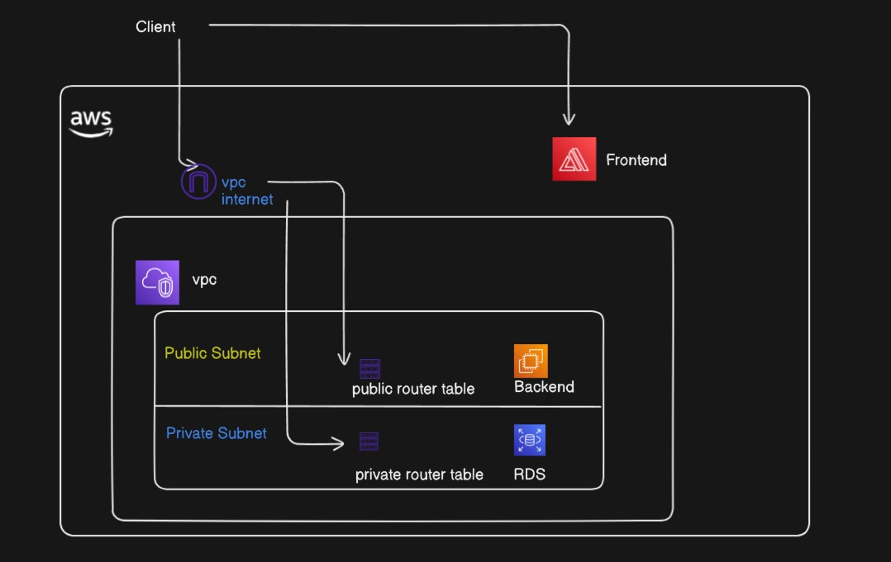
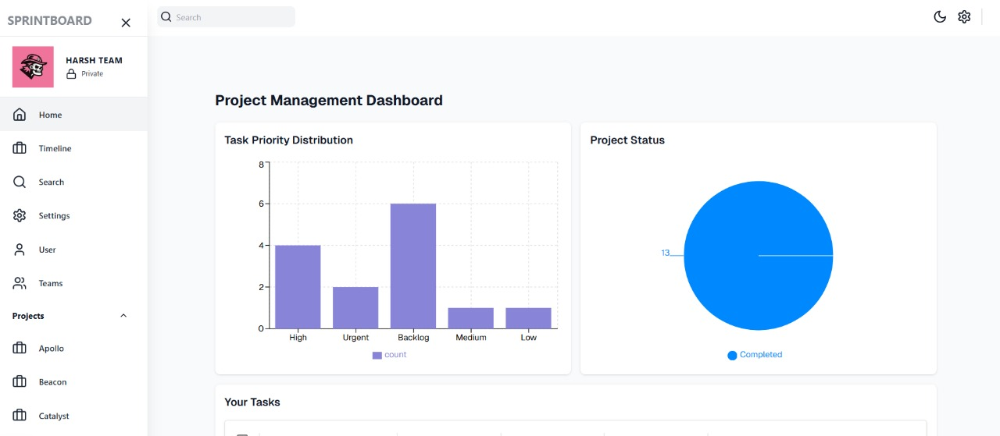
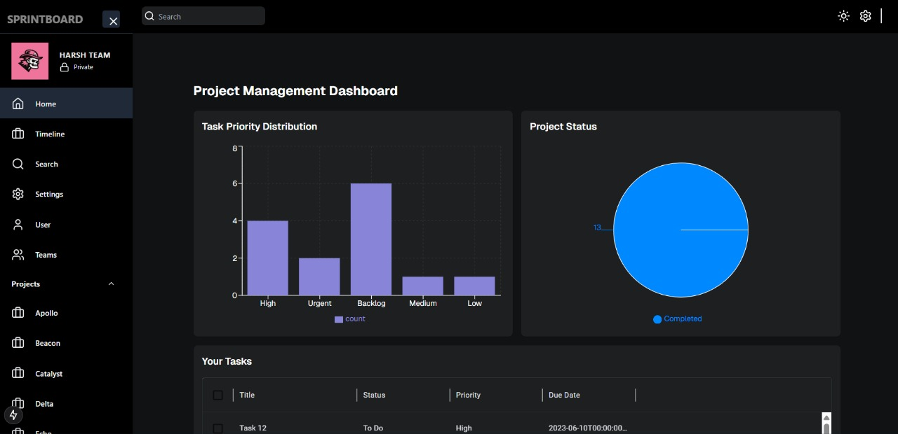
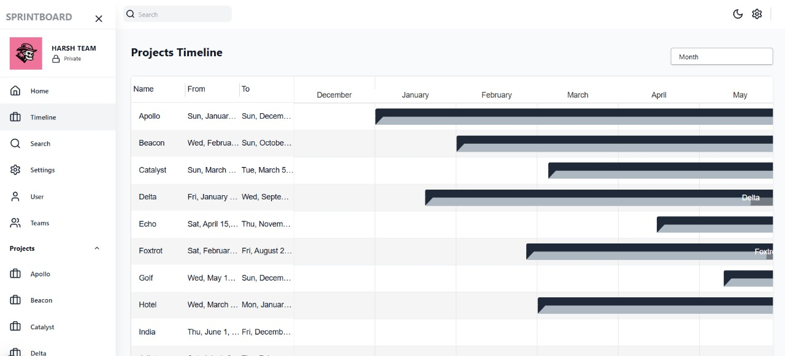

# SprintBoard - Advanced Workflow Orchestration Platform

## Overview

SprintBoard is a cutting-edge Workflow Orchestration Platform designed to streamline task automation, resource allocation, and team collaboration in complex operational environments. Built with a robust stack of modern technologies, SprintBoard provides a highly scalable and intuitive interface for managing intricate workflows, data-driven decision-making, and real-time project tracking.

## Technologies I Used

### Frontend

- **Next.js** - Enables server-side rendering (SSR) and static site generation (SSG) for optimal performance.
- **Tailwind CSS** - A utility-first CSS framework for rapid UI development.
- **Material UI Data Grid** - Provides seamless handling of complex data visualizations.
- **Redux Toolkit** - Manages application state efficiently.
- **Redux Toolkit Query** - Facilitates efficient data fetching and caching mechanisms.

### Backend

- **Node.js & Express** - Serve as the foundation for server-side logic and API endpoints.
- **PostgreSQL** - A high-performance relational database for data persistence.
- **Prisma** - A next-generation ORM for efficient database interactions.
- **PgAdmin** - Integrated for database monitoring and administration.
- **AWS Services** - Ensures scalability, reliability, and cloud-native functionality.
  - [AWS Documentation](https://docs.aws.amazon.com/)

## Features

- **Task Automation** - Automate recurring processes to enhance efficiency.
- **Resource Allocation** - Optimize resource usage dynamically.
- **Team Collaboration** - Foster seamless collaboration with integrated tools.
- **Data-Driven Decision Making** - Leverage analytics for informed choices.
- **Real-Time Project Tracking** - Monitor project progress with live updates.

## Getting Started

### Prerequisites

Ensure you have the following installed:

- Node.js (latest LTS version)
- PostgreSQL
- PgAdmin (optional, for database administration)

### Installation

1. Clone the repository:

   ```sh
   git clone https://github.com/HarshMN2345/SprintBoard.git
   cd sprintboard
   ```

2. Install dependencies:

   ```sh
   npm install
   ```

3. Configure environment variables:

   - Create a `.env` file in the root server directory and add your database and AWS credentials.

4. Run the development server:

   ```sh
   npm run dev
   ```

5. Access the application at `http://localhost:3000`(locally).

## Project Images

Below are some images showcasing the project:







## Project Demonstration

Watch the project demonstration using the following Google Drive link:

[Project Demo](https://drive.google.com/file/d/16rYzhNaEFBZlBRXJp-jxvzguUAvn25Fd/view?usp=sharing)

## License

SprintBoard is released under the MIT License. See the `LICENSE` file for more details.

---

Developed with ❤️ by Harsh Mahajan


